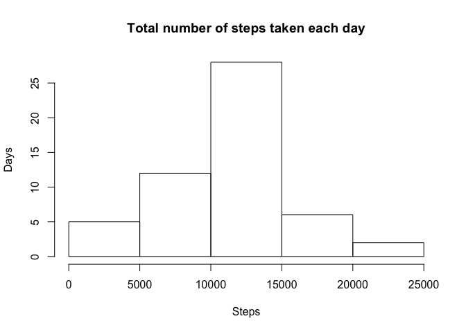
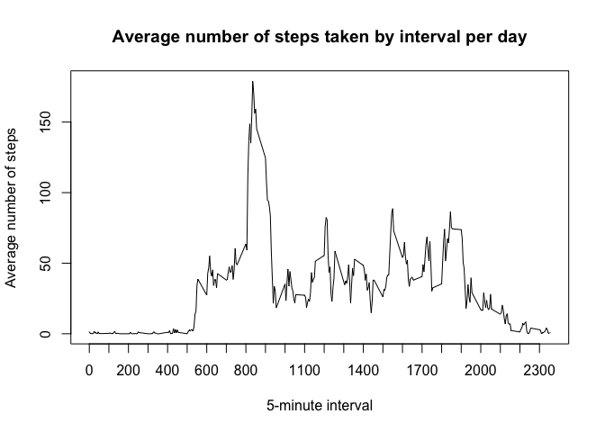
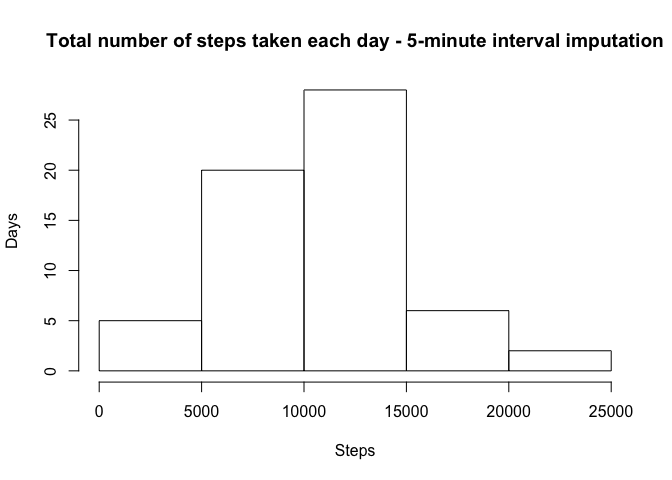
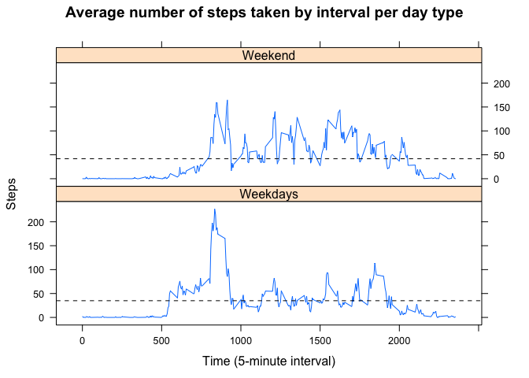

# Activity Monitoring Data

In this report I process the physical activity data from an anonymous individual collected during the months of October and November, 2012. These data include the number of steps taken in 5-minute intervals each day along this period.

## 1. Loading and preprocessing the data

First, we unzip the data in the working project directory. Then, we should load the data into de R environment. We choose not to convert strings as factors to avoid further problems while reformatting our variables.


```r
unzip("activity.zip", list = FALSE)
activity.data <- read.csv(file = "activity.csv", stringsAsFactors = FALSE,
                           header = TRUE, fileEncoding = "latin1")
```

After loading the data, we preprocess it to make sure ourselves the data is tidy. The first thing to do is to explore the dataset and to know in which format our variables are stored.


```r
str(activity.data)
```

```
## 'data.frame':	17568 obs. of  3 variables:
##  $ steps   : int  NA NA NA NA NA NA NA NA NA NA ...
##  $ date    : chr  "2012-10-01" "2012-10-01" "2012-10-01" "2012-10-01" ...
##  $ interval: int  0 5 10 15 20 25 30 35 40 45 ...
```

By this exploration, we can see that the date variable is in an R date format (%Y-%m-%d) although it is stored as a character variable. Next, we should set the date up with the command as.Date. As the time zone is not specified from the original source, we assing our current location as the default time zone.


```r
activity.data$date <-  as.Date(activity.data$date, tz = Sys.timezone())
```

We can see that the date variable is stored now in a date format.


```r
str(activity.data)
```

```
## 'data.frame':	17568 obs. of  3 variables:
##  $ steps   : int  NA NA NA NA NA NA NA NA NA NA ...
##  $ date    : Date, format: "2012-10-01" "2012-10-01" ...
##  $ interval: int  0 5 10 15 20 25 30 35 40 45 ...
```

## 2. What is the mean total number of steps taken per day?
After having loaded and preprocessed our data set we should start making some calculations to get the main descriptive statistics. The first one is the mean total number of steps taken per day.

The mean total number of steps taken per day is the result of adding all the steps taken and then dividing this number by the total number of days in which this measurement was made. 

```r
total.steps <- sum(activity.data$steps, na.rm = TRUE)
print(total.steps)
```

```
## [1] 570608
```

```r
total.days <- length(unique(activity.data$date))
print(total.days)
```

```
## [1] 61
```

```r
mean.steps <- total.steps/total.days
print(mean.steps)
```

```
## [1] 9354.23
```

So, on average, our individual took 9,354 steps everyday.

### 2.1 Calculate the total number of steps taken per day

We calculate the total number of steps taken per date using the aggregate function and applying, as well, the sum function to it. We store the result of the aggregation in a new data frame.


```r
steps.per.day <- aggregate(formula = steps ~ date, data = activity.data, FUN = sum)
print(steps.per.day)
```

### 2.2 Make a histogram of the total number of steps taken each day

Then, after having aggreated the total number of steps taken per date, we can plot a histogram that shows the distribution of the total number of steps taken each day. As for the break points of the histogram, we use the conventional method of Sturges to determine the classes of the graph.


```r
hist(steps.per.day$steps, breaks = "Sturges", main = "Total number of steps taken each day", xlab = "Steps", ylab = "Days")
```

<!-- -->

We see a normal distribution in the data, meaning that, in most days, our individual probably will take around 10,000 and 15,000 steps in a whole day.

### 2.3 Calculate and report the mean and median of the total number of steps taken per day

Finally, we calculate the median and the mean of the steps taken each day using the aggregation data from section 2.1.


```r
median(steps.per.day$steps)
```

```
## [1] 10765
```

```r
mean(steps.per.day$steps)
```

```
## [1] 10766.19
```

Since aggregation excludes the rows with missing values, the total number of dates upon which the mean and the median are calculated by this method is (53) less than the total number of dates recorded in the original data set (61). This is why the mean calculated is higher than the first one by more than 1,000 steps.

### 3.  What is the average daily activity pattern?

The average daily activity pattern reflects the mean activity per 5-minute interval for all the dates in which it was measured. This helps us to understand in what moment of the day our individual is the most active. 

To make this, we sum the total number of steps taken for all the 5-minute intervals recorded and we store the results in a new data frame. 


```r
intervals <- aggregate(steps ~ interval, data = activity.data, sum)
str(intervals)
```

```
## 'data.frame':	288 obs. of  2 variables:
##  $ interval: int  0 5 10 15 20 25 30 35 40 45 ...
##  $ steps   : int  91 18 7 8 4 111 28 46 0 78 ...
```

We modify the name of the second variable of the new data frame to work with more clarity.


```r
names(intervals)[2] <- "total.steps.interval"
names(intervals)
```

```
## [1] "interval"             "total.steps.interval"
```

Finally, we create a new variable that averages the steps taken by interval everyday.


```r
intervals$mean.steps.interval <- intervals$total.steps.interval/length(unique(activity.data$date))
str(intervals)
```

```
## 'data.frame':	288 obs. of  3 variables:
##  $ interval            : int  0 5 10 15 20 25 30 35 40 45 ...
##  $ total.steps.interval: int  91 18 7 8 4 111 28 46 0 78 ...
##  $ mean.steps.interval : num  1.4918 0.2951 0.1148 0.1311 0.0656 ...
```

### 3.1 Make a time series plot of the 5-minute interval (x-axis) and the average number of steps taken, averaged across all days (y-axis)

After this, we make a time series plot of the 5-minute interval (x-axis) 
and the average number of steps taken, averaged across all days (y-axis).


```r
with(intervals, plot(x = interval, y = mean.steps.interval, type = "l", 
                     main = "Average number of steps taken by interval per day",
                     xlab = "5-minute interval",
                     ylab = "Average number of steps",
                     xaxt  = "n"))
axis(side = 1, at = seq(from = 0, to = 2300, by = 100), 
     labels = seq(from = 0, to = 2300, by = 100))
```

<!-- -->

### 3.2 Which 5-minute interval, on average across all the days in the dataset, contains the maximum number of steps?

We observe that the walking activity peak occurs between 8:00 a.m and 9:00 a.m. But, at what moment specifically? To know this, we survey our last data set. 


```r
intervals[which.max(intervals$mean.steps.interval), ]
```

```
##     interval total.steps.interval mean.steps.interval
## 104      835                10927            179.1311
```

Now we know that, on average, our individual will take more steps at the 8:35 5-minute interval. Maybe, before she is walking to her job.

## 4. Imputing missing values

Per our first exploration of the data set we saw that there were missing values in our activity monitoring. However, we do not know if this missing values are dispersed across several variables or if they group around only one variable and how. To have an idea of how missing values are distributed across our data set we should explore the variables of the original data set again.

### 4.1 Calculate and report the total number of missing values in the dataset

Accordingly, to devise a strategy to imput missing values we need to know the total number of missing values for each variable.


```r
colSums((is.na(activity.data)))
```

```
##    steps     date interval 
##     2304        0        0
```

We can see that there are no missing values for the date and interval variables, but that the variable steps is missing several observations.

However, knowing how many missing values are in the steps variable is not enough to devise an imputing strategy. Are this missing values distribuited in some sort or are they just scattered through the variable? That is to say, did the activity monitoring fail among intervals or did the individual just skip the monitoring in given dates? To find out, we create a new variable, missing.steps, that accounts for how this values add up in relation to the date and interval variables.
 

```r
activity.data$missing.steps <- ifelse(is.na(activity.data$steps), 1, 0)
aggregate(formula = missing.steps ~ date, data = activity.data, FUN = sum)
```

```
##          date missing.steps
## 1  2012-10-01           288
## 2  2012-10-02             0
## 3  2012-10-03             0
## 4  2012-10-04             0
## 5  2012-10-05             0
## 6  2012-10-06             0
## 7  2012-10-07             0
## 8  2012-10-08           288
## 9  2012-10-09             0
## 10 2012-10-10             0
## 11 2012-10-11             0
## 12 2012-10-12             0
## 13 2012-10-13             0
## 14 2012-10-14             0
## 15 2012-10-15             0
## 16 2012-10-16             0
## 17 2012-10-17             0
## 18 2012-10-18             0
## 19 2012-10-19             0
## 20 2012-10-20             0
## 21 2012-10-21             0
## 22 2012-10-22             0
## 23 2012-10-23             0
## 24 2012-10-24             0
## 25 2012-10-25             0
## 26 2012-10-26             0
## 27 2012-10-27             0
## 28 2012-10-28             0
## 29 2012-10-29             0
## 30 2012-10-30             0
## 31 2012-10-31             0
## 32 2012-11-01           288
## 33 2012-11-02             0
## 34 2012-11-03             0
## 35 2012-11-04           288
## 36 2012-11-05             0
## 37 2012-11-06             0
## 38 2012-11-07             0
## 39 2012-11-08             0
## 40 2012-11-09           288
## 41 2012-11-10           288
## 42 2012-11-11             0
## 43 2012-11-12             0
## 44 2012-11-13             0
## 45 2012-11-14           288
## 46 2012-11-15             0
## 47 2012-11-16             0
## 48 2012-11-17             0
## 49 2012-11-18             0
## 50 2012-11-19             0
## 51 2012-11-20             0
## 52 2012-11-21             0
## 53 2012-11-22             0
## 54 2012-11-23             0
## 55 2012-11-24             0
## 56 2012-11-25             0
## 57 2012-11-26             0
## 58 2012-11-27             0
## 59 2012-11-28             0
## 60 2012-11-29             0
## 61 2012-11-30           288
```

```r
aggregate(formula = missing.steps ~ interval, data = activity.data, FUN = sum)
```

```
##     interval missing.steps
## 1          0             8
## 2          5             8
## 3         10             8
## 4         15             8
## 5         20             8
## 6         25             8
## 7         30             8
## 8         35             8
## 9         40             8
## 10        45             8
## 11        50             8
## 12        55             8
## 13       100             8
## 14       105             8
## 15       110             8
## 16       115             8
## 17       120             8
## 18       125             8
## 19       130             8
## 20       135             8
## 21       140             8
## 22       145             8
## 23       150             8
## 24       155             8
## 25       200             8
## 26       205             8
## 27       210             8
## 28       215             8
## 29       220             8
## 30       225             8
## 31       230             8
## 32       235             8
## 33       240             8
## 34       245             8
## 35       250             8
## 36       255             8
## 37       300             8
## 38       305             8
## 39       310             8
## 40       315             8
## 41       320             8
## 42       325             8
## 43       330             8
## 44       335             8
## 45       340             8
## 46       345             8
## 47       350             8
## 48       355             8
## 49       400             8
## 50       405             8
## 51       410             8
## 52       415             8
## 53       420             8
## 54       425             8
## 55       430             8
## 56       435             8
## 57       440             8
## 58       445             8
## 59       450             8
## 60       455             8
## 61       500             8
## 62       505             8
## 63       510             8
## 64       515             8
## 65       520             8
## 66       525             8
## 67       530             8
## 68       535             8
## 69       540             8
## 70       545             8
## 71       550             8
## 72       555             8
## 73       600             8
## 74       605             8
## 75       610             8
## 76       615             8
## 77       620             8
## 78       625             8
## 79       630             8
## 80       635             8
## 81       640             8
## 82       645             8
## 83       650             8
## 84       655             8
## 85       700             8
## 86       705             8
## 87       710             8
## 88       715             8
## 89       720             8
## 90       725             8
## 91       730             8
## 92       735             8
## 93       740             8
## 94       745             8
## 95       750             8
## 96       755             8
## 97       800             8
## 98       805             8
## 99       810             8
## 100      815             8
## 101      820             8
## 102      825             8
## 103      830             8
## 104      835             8
## 105      840             8
## 106      845             8
## 107      850             8
## 108      855             8
## 109      900             8
## 110      905             8
## 111      910             8
## 112      915             8
## 113      920             8
## 114      925             8
## 115      930             8
## 116      935             8
## 117      940             8
## 118      945             8
## 119      950             8
## 120      955             8
## 121     1000             8
## 122     1005             8
## 123     1010             8
## 124     1015             8
## 125     1020             8
## 126     1025             8
## 127     1030             8
## 128     1035             8
## 129     1040             8
## 130     1045             8
## 131     1050             8
## 132     1055             8
## 133     1100             8
## 134     1105             8
## 135     1110             8
## 136     1115             8
## 137     1120             8
## 138     1125             8
## 139     1130             8
## 140     1135             8
## 141     1140             8
## 142     1145             8
## 143     1150             8
## 144     1155             8
## 145     1200             8
## 146     1205             8
## 147     1210             8
## 148     1215             8
## 149     1220             8
## 150     1225             8
## 151     1230             8
## 152     1235             8
## 153     1240             8
## 154     1245             8
## 155     1250             8
## 156     1255             8
## 157     1300             8
## 158     1305             8
## 159     1310             8
## 160     1315             8
## 161     1320             8
## 162     1325             8
## 163     1330             8
## 164     1335             8
## 165     1340             8
## 166     1345             8
## 167     1350             8
## 168     1355             8
## 169     1400             8
## 170     1405             8
## 171     1410             8
## 172     1415             8
## 173     1420             8
## 174     1425             8
## 175     1430             8
## 176     1435             8
## 177     1440             8
## 178     1445             8
## 179     1450             8
## 180     1455             8
## 181     1500             8
## 182     1505             8
## 183     1510             8
## 184     1515             8
## 185     1520             8
## 186     1525             8
## 187     1530             8
## 188     1535             8
## 189     1540             8
## 190     1545             8
## 191     1550             8
## 192     1555             8
## 193     1600             8
## 194     1605             8
## 195     1610             8
## 196     1615             8
## 197     1620             8
## 198     1625             8
## 199     1630             8
## 200     1635             8
## 201     1640             8
## 202     1645             8
## 203     1650             8
## 204     1655             8
## 205     1700             8
## 206     1705             8
## 207     1710             8
## 208     1715             8
## 209     1720             8
## 210     1725             8
## 211     1730             8
## 212     1735             8
## 213     1740             8
## 214     1745             8
## 215     1750             8
## 216     1755             8
## 217     1800             8
## 218     1805             8
## 219     1810             8
## 220     1815             8
## 221     1820             8
## 222     1825             8
## 223     1830             8
## 224     1835             8
## 225     1840             8
## 226     1845             8
## 227     1850             8
## 228     1855             8
## 229     1900             8
## 230     1905             8
## 231     1910             8
## 232     1915             8
## 233     1920             8
## 234     1925             8
## 235     1930             8
## 236     1935             8
## 237     1940             8
## 238     1945             8
## 239     1950             8
## 240     1955             8
## 241     2000             8
## 242     2005             8
## 243     2010             8
## 244     2015             8
## 245     2020             8
## 246     2025             8
## 247     2030             8
## 248     2035             8
## 249     2040             8
## 250     2045             8
## 251     2050             8
## 252     2055             8
## 253     2100             8
## 254     2105             8
## 255     2110             8
## 256     2115             8
## 257     2120             8
## 258     2125             8
## 259     2130             8
## 260     2135             8
## 261     2140             8
## 262     2145             8
## 263     2150             8
## 264     2155             8
## 265     2200             8
## 266     2205             8
## 267     2210             8
## 268     2215             8
## 269     2220             8
## 270     2225             8
## 271     2230             8
## 272     2235             8
## 273     2240             8
## 274     2245             8
## 275     2250             8
## 276     2255             8
## 277     2300             8
## 278     2305             8
## 279     2310             8
## 280     2315             8
## 281     2320             8
## 282     2325             8
## 283     2330             8
## 284     2335             8
## 285     2340             8
## 286     2345             8
## 287     2350             8
## 288     2355             8
```

Because we know that each day has 288 5-minute intervals, this aggregation let us see that missing steps values are evenly distribuited across intervals and in complete certain dates only.  

### 4.2 Fill the missing values in the dataset - mean for the 5-minute interval

Correspondingly, our imputation strategy will be to assign the average activity per 5-minute interval for all the dates in which it was measured. We make this in a new variable called imputed.steps. We specify two concurrent conditions for creating this variable. First, it should be a missing value from the steps variable in the original activity.data set and, second, the interval record should be the same of the interval variable from the aggregation data frame we created in section 3, which contains the average activity per 5-minute interval for all days. This will fill the holes in our data.


```r
imputed.steps <- ifelse(is.na(activity.data$steps) & 
                                activity.data$interval == intervals$interval, 
                        intervals$mean.steps.interval, activity.data$steps)
```

### 4.3 Create a new dataset that is equal to the original dataset but with the missing data filled in

Then, we create a new data frame from the original one. Next, we assign the imputed steps variable to the steps variable in the new data frame.


```r
new.activity.data <- activity.data
new.activity.data$steps <- imputed.steps
```

We verify the differeces between data sets. The original data set has this structure:


```r
str(activity.data)
```

```
## 'data.frame':	17568 obs. of  4 variables:
##  $ steps        : int  NA NA NA NA NA NA NA NA NA NA ...
##  $ date         : Date, format: "2012-10-01" "2012-10-01" ...
##  $ interval     : int  0 5 10 15 20 25 30 35 40 45 ...
##  $ missing.steps: num  1 1 1 1 1 1 1 1 1 1 ...
```

While the new one has this structure:


```r
str(new.activity.data)
```

```
## 'data.frame':	17568 obs. of  4 variables:
##  $ steps        : num  1.4918 0.2951 0.1148 0.1311 0.0656 ...
##  $ date         : Date, format: "2012-10-01" "2012-10-01" ...
##  $ interval     : int  0 5 10 15 20 25 30 35 40 45 ...
##  $ missing.steps: num  1 1 1 1 1 1 1 1 1 1 ...
```

We now observe that our second data frame has no missing values in the steps variable. But, how does this imputation modified the distribution of our data?

### 4.4 Make a histogram of the total number of steps taken each day

To answer this question, we plot a new histogram with the data from the imputed data frame. But first, we need to aggregate the new total number steps taken per day, just as we did in section 2.1.


```r
new.steps.per.day <- aggregate(formula = steps ~ date, data = new.activity.data, FUN = sum)
```

With this new data frame, we can plot the new histogram.


```r
hist(new.steps.per.day$steps, breaks = "Sturges", 
     main = "Total number of steps taken each day - 5-minute interval imputation",
     xlab = "Steps", ylab = "Days")
```

<!-- -->

Now, we can see that this distribution is more left-weighted than the first one. This means that is more probable that our individual takes between 5,000 and 15,000 steps in any given day.

### 4.5  Calculate and report the mean and median total number of steps taken per day

By recalling the old value of the mean and the median of the total steps taken by our individual we get:


```r
mean(steps.per.day$steps, na.rm = TRUE)
```

```
## [1] 10766.19
```

```r
median(steps.per.day$steps, na.rm = TRUE)
```

```
## [1] 10765
```

That is to say, without imputation, our individual took an average of 10,766 steps per day. With a median of 10,765 steps for the distribution of her activity.

Now, we calculate the new values for the mean and the median of the total steps taken by our individual with the 5-minute imputation.


```r
mean(new.steps.per.day$steps)
```

```
## [1] 10581.01
```

```r
median(new.steps.per.day$steps)
```

```
## [1] 10395
```

With imputation, our individual takes an average of 10,581 steps per day. With a median of 10,395 steps for the distribution of her activity.

If we compare these variations, we might conclude imputation did not make too much of a difference. But if we consider the first average calculated in section 2 (9,354), we can see that imputation is important to obtain a more accurate result.

## 5. Are there differences in activity patterns between weekdays and weekends?

Weekdays and weekends are different for the most of us. If our individual goes to her job every weekday but not in weekends we should see that, on average, she walks less on Saturdays and Sundays than in the rest of the week. Or if we see an increase in her walking activity in weekends we might wonder what activities she does practice in those days.

Then, we should create a new dummy variable that allows us to differentiate between weekdays and weekends. To help ourselves with plotting, we would create this variable as a factor, in case we want to see labels in our plot.

Since we have the exact dates of activity, we use the special function weekdays() to know the day of the week to which any given date belongs.


```r
new.activity.data$weekday <- weekdays(new.activity.data$date, abbreviate = TRUE)
```

After having created the weekday variable, we can now create our factor variable based upon two alternate conditions. If the abbreviation of the variable weekday is "Sat" or if the abbreviation is "Sun", then, we assign the value "Weekend" to the variable weekend. If the weekday has any other value, assign the value "Weekdays" to the weekend variable.


```r
new.activity.data$weekend <- ifelse(new.activity.data$weekday == "Sat" | new.activity.data$weekday == "Sun", "Weekend", "Weekdays")
```

Also, we need to make sure the new variable weekend to be a factor variable because it will help when we use the lattice plotting system.


```r
new.activity.data$weekend <- as.factor(new.activity.data$weekend)
```

As in previous sections, we can not plot directly from our original data set because we need to aggregate the data in a convenient format before. In this case, we need to calculate the average steps taken in a given interval for all the days, but adding a condition that accounts if these days are weekends or not. The way to put this in a formula and to store it in a new data frame is this:


```r
intervals.weekends <- aggregate(formula = steps ~ interval + weekend, data = new.activity.data, FUN = mean)
```

By this operation, we obtain a new data frame with the average steps taken for any given interval for all days but with the distinction of weekdays and weekends.


```r
str(intervals.weekends)
```

```
## 'data.frame':	576 obs. of  3 variables:
##  $ interval: int  0 5 10 15 20 25 30 35 40 45 ...
##  $ weekend : Factor w/ 2 levels "Weekdays","Weekend": 1 1 1 1 1 1 1 1 1 1 ...
##  $ steps   : num  2.2211 0.4393 0.1709 0.1953 0.0976 ...
```

Now, we can call the lattice plotting system to know if there are any differences in walking activity between weekdays and weekends.


```r
library("lattice")
xyplot(steps ~ interval | as.factor(weekend), data = intervals.weekends, 
       type = "l", layout = c(1,2),
       main = "Average number of steps taken by interval per day type", 
       ylab = "Steps", xlab = "Time (5-minute interval)",
       panel = function(x, y, ...){
               panel.xyplot(x, y, ...)
               panel.abline(h = mean(y), lty = 2)
       })
```

<!-- -->

By the results of the plot, we see that, on average, our individual takes a few more steps in her weekends than in her weekdays. Also, that her activity is more constant along the weekend and that she also starts her days erlier in weekdays.

If we calculate the mean steps given in a 5-minute interval per weekday or weekend we could say that our individual is almost 7 steps more active on weekends per 5-minute interval than in weekdays.

```r
mean(intervals.weekends[intervals.weekends$weekend == "Weekdays","steps"])
```

```
## [1] 34.9569
```

```r
mean(intervals.weekends[intervals.weekends$weekend == "Weekend","steps"])
```

```
## [1] 41.75357
```


